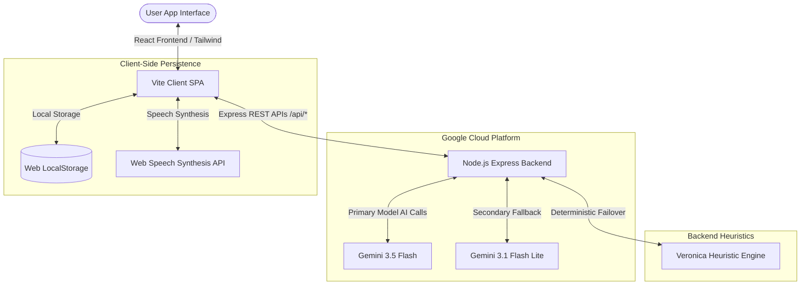
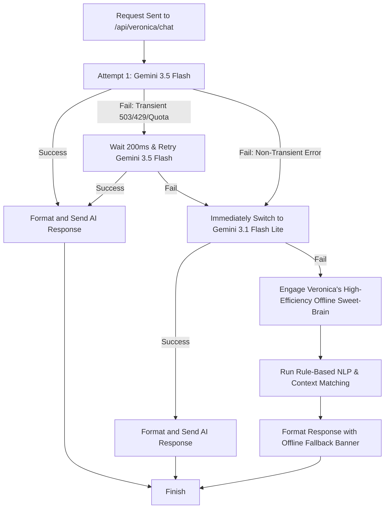
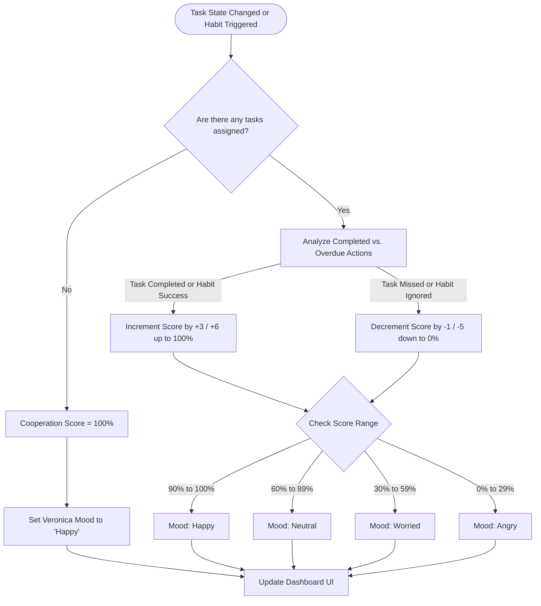

# Veronica AI — Project Overview & Documentation

An interactive, resilient, and gamified AI companion designed to solve accountability, time management, and note-taking challenges through high-fidelity conversational guidance, dynamic cooperation scoring, and robust offline-first architecture.

---

## 1. Problem Statement Selected

Modern productivity apps are often cold, mechanical, and easily ignored. Users face several core hurdles that degrade their daily efficiency:
1. **The Accountability Gap**: Standard task planners and habit trackers are passive. Without an active external feedback loop or engaging presence, users routinely abandon their goals.
2. **Fragmented Workflows**: Note-taking, deadline tracking, and task delegation reside in separate systems, requiring excessive manual context switching.
3. **Fragile AI Infrastructure**: Cloud-hosted AI features typically break completely during API rate-limiting, quota depletion, or temporary server unavailability, leaving users without critical assistance when they need it most.

---

## 2. Solution Overview

**Veronica AI** bridges the gap between mechanical organization and supportive human-like companionship. Serving as an interactive personal coordinator, Veronica keeps users on track by reacting dynamically to their productivity patterns. 

The system leverages:
* **Gamified Accountability (Cooperation Score)**: Veronica keeps a "Cooperation Score" reflecting how well the user is staying on top of their commitments. If no tasks are assigned, the score remains perfectly at **100%**. As soon as tasks are delegated, any missed deadlines or neglected obligations drop the score, while consistent check-ins and completions restore it, affecting Veronica's real-time mood and dialogue.
* **Resilient Multilayered AI Server**: An ultra-reliable backend routing pipeline designed to withstand cloud transient failures. If the high-capability `gemini-3.5-flash` model experiences rate limits or high-demand timeouts, the server instantly retries and falls back to `gemini-3.1-flash-lite`. If all cloud systems fail, Veronica's localized "offline sweet-brain" heuristics seamlessly assume control to parse deadlines and format text without disrupting the user.

---

## 3. Key Features

### 🎙️ Multi-Mood Conversational AI & Voice
* Veronica speaks back using high-fidelity native voice synthesis.
* Her avatar, text, and voice tones adapt across four distinct moods: **Happy**, **Neutral**, **Worried**, and **Angry**, matching the status of your cooperation.

### 🎯 Smart Deadline Tracker
* Input tasks naturally (e.g., *"Finish physics report by tomorrow at 5 PM"*).
* The AI-driven backend parses and computes the exact relative and absolute UTC deadlines automatically.

### 💖 Gamified Cooperation Score
* Keeps you accountable:
  * **100% Base State**: If you haven't assigned anything yet, your score is locked at a flawless 100%.
  * **Dynamic Fluctuations**: Completing tasks/habits boosts the score; failing tasks or letting habits decay drops it.
  * **Mood Coupling**: Low scores trigger Veronica's worried or angry states, prompting her to nudge you back on track.

### 📝 AI-Enhanced Notebook & Polisher
* Capture raw ideas in a clean writing canvas.
* Use the **Polish Note** action to automatically transform disorganized drafts into professional, structured markdown documents.

### ⏱️ Focused Study Sprint blocks
* Activate study mode to silence external noises and embark on structured, focused sprint blocks with direct encouragement.

---

## 4. Key Workflows & Diagrams

### A. High-Level System Architecture
The application runs as a cohesive full-stack React and Express platform deployed seamlessly on Google Cloud Run container layers:

---

### B. Resilient AI Fallback Workflow
Veronica is designed to be highly reliable. If Google Cloud experiences temporary stress, the backend implements a fast-retry and dual-model failover algorithm:

---

### C. Cooperation Score Update Logic
An elegant state machine maintaining high standards of user accountability:

---

## 5. Technologies Used

| Category | Technology | Description |
| :--- | :--- | :--- |
| **Frontend Framework** | React 18 (Vite, TypeScript) | Powering the interface with robust type-safe states and modular component architecture. |
| **Styling** | Tailwind CSS | Utility-first classes allowing precise custom alignments, dark slate layouts, and high-contrast styling. |
| **Animations** | Framer Motion | Smooth entry transitions, interactive micro-animations, and animated avatar waves. |
| **Icons** | Lucide React | Modern, clean vector iconography. |
| **Backend Framework** | Express.js / Node.js | Supporting high-performance API routers, CORS controls, and direct proxy pipelines. |
| **Build Tools** | Esbuild & TSX | Fast development runtime compiling TypeScript directly, and bundling production servers. |

---

## 6. Google Technologies Utilized

1. **Google Gemini API**:
   * Accessed through the modern, unified `@google/genai` TypeScript SDK.
   * Coordinates the conversational workspace, smart NLP parser, and systemic notes formatting engine.
2. **Gemini 3.5 Flash (`gemini-3.5-flash`)**:
   * Used as the primary reasoning core. It handles complex multi-turn chats, extracts temporal parameters, and formats markdown documents with low-latency thinking.
3. **Gemini 3.1 Flash Lite (`gemini-3.1-flash-lite`)**:
   * Serves as our highly available secondary routing model, maintaining chat continuity and handling high-concurrency demands without compromising output fidelity.
4. **Google Cloud Run**:
   * The container runtime environment, providing instant secure auto-scaling and highly efficient reverse proxy ingress routing to port `3000`.
